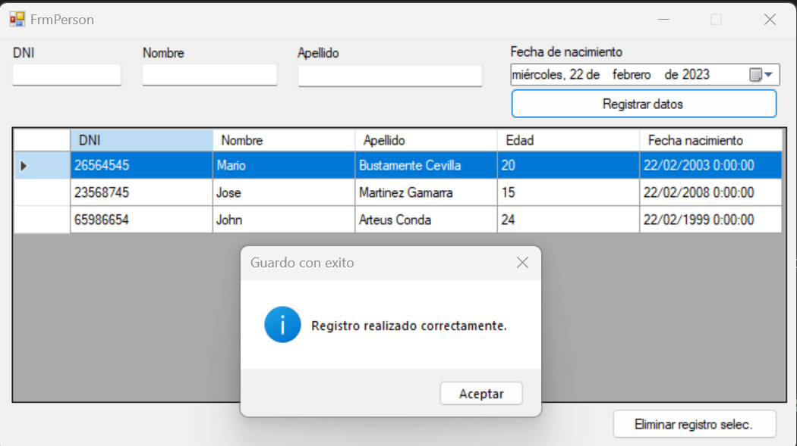

# CRUD de Person en C# con EntityFramework y SQL Server
## _Dividido en 4 capas_



[](https://travis-ci.org/joemccann/dillinger)

Esta repositorio muestra en 4 capas el crud de una tabla person de mysql conectado con ADO.NET.  


## Features
Las capas son:  

- PresentationLayer ✨
- BusinessLayes ✨
- DataAccessLayer ✨
- DataTransferLayer ✨

## Installation

Para que pueda funcionar este repositorio instale:

- Microsoft visual studio 2019
- Servidor SQL server 2014 en adelante

Clone este repositorio y abralo directamente desde el IDE indicado mas arriba

```sh
git clone git@github.com:velnae/CRUD-Person-C-Sharp-Entity-Framework.git
```

Correr el siguiente script sql:  

```sql
create table tperson
(
    idPerson char(36) not null,
    dni char(8) not null,
    firstName varchar(70) not null,
    surName varchar(40) not null,
    birthDate date not null,
    primary key(idPerson)
);
```

## License

MIT

**Free Software, Hell Yeah!**


